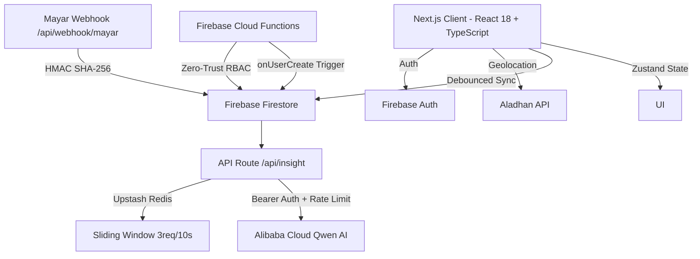

<div align="center">
  
  

  # 🌙 Ramadhan VibeTracker V2
  
  **Interactive AI-Powered Spiritual Consistency Ecosystem**

  [](https://nextjs.org/)
  [](https://www.typescriptlang.org/)
  [](https://firebase.google.com/)
  [](https://zustand-demo.pmnd.rs/)
  [](https://zod.dev/)
  [](https://tailwindcss.com/)
  [](LICENSE)

  <p align="center">
    A unified spiritual tracking platform designed to build worship consistency during the holy month of Ramadhan, powered by <b>AI Insights</b>, <b>Real-time Sync</b>, and <b>Enterprise-grade Security</b>.
  </p>
</div>

---

## 🚀 Key Features

- **🧠 AI Spiritual Companion** — Integration with Alibaba Cloud Qwen-Turbo LLM for personalized worship insights and motivation based on daily activity patterns.
- **🔄 Vibe Engine (Zustand + Firebase)** — Two-way state synchronization with debounced auto-save, ensuring worship data is never lost.
- **🕌 Geolocation-Aware Prayer Times** — Dynamic prayer schedule using the Aladhan API (Kemenag RI Method 20) with GPS fallback protection.
- **🔔 Eternal Notification Engine** — Web Push reminders (FCM) with persistent notification history stored in Firestore.
- **📊 Consistency Heatmap** — GitHub-style contribution calendar visualizing 30-day worship activity using `react-calendar-heatmap`.
- **👨‍🏫 Multi-Role Dashboard** — Teacher Portal (real-time student monitoring), Parent Observer, and Student Dashboard with role-based access control.
- **🛡️ Enterprise Security** — 4-layer API defense (Auth → Rate Limiting → Payload Validation → LLM), Cloud Functions for zero-trust RBAC, and HMAC webhook verification.
- **🔒 Dual-Layer Type Safety** — TypeScript for compile-time protection + Zod for runtime data validation against corrupted Firestore payloads.

## 🛠️ Architecture

Built on the **Next.js 14 App Router** with clear separation between client-side logic and serverless API routes.



### Frontend Architecture (Post-Decoupling)

| Layer | File | Responsibility |
|-------|------|----------------|
| **Custom Hook** | `hooks/usePrayerTimes.js` | Geolocation + Aladhan API + Hijri calendar |
| **Custom Hook** | `hooks/useVibeSync.js` | Debounced Firestore sync + beforeUnload guard |
| **Schemas** | `lib/schemas.ts` | Zod schemas (Source of Truth for all data shapes) |
| **Store** | `store/useVibeStore.ts` | Zustand global state with strict TypeScript interface |
| **Data Layer** | `lib/firebase.ts` | All Firestore operations with Zod runtime validation |
| **UI Components** | `app/dashboard/*/` | Pure rendering components (Separation of Concerns) |

## 📦 Installation

### Prerequisites

- Node.js 18.17.0 or higher
- Firebase project (Authentication, Firestore, Cloud Messaging)
- Alibaba Cloud API Key (for AI Insights)
- Upstash Redis account (for Rate Limiting — optional, graceful degradation)

### Setup

```bash
# 1. Clone the repository
git clone https://github.com/0xshalah/Ramadhan-VibeTracker-V2.git
cd Ramadhan-VibeTracker-V2

# 2. Install dependencies
npm install

# 3. Configure environment variables
cp .env.local.example .env.local
# Fill in your Firebase, Alibaba Cloud, Upstash, and Mayar credentials

# 4. Start development server
npm run dev
```

### Environment Variables

```env
# Firebase
NEXT_PUBLIC_FIREBASE_API_KEY=
NEXT_PUBLIC_FIREBASE_AUTH_DOMAIN=
NEXT_PUBLIC_FIREBASE_PROJECT_ID=
NEXT_PUBLIC_FIREBASE_STORAGE_BUCKET=
NEXT_PUBLIC_FIREBASE_MESSAGING_SENDER_ID=
NEXT_PUBLIC_FIREBASE_APP_ID=
NEXT_PUBLIC_FIREBASE_VAPID_KEY=

# AI Engine
ALIBABA_CLOUD_API_KEY=

# Rate Limiting (Optional — graceful degradation if not set)
UPSTASH_REDIS_REST_URL=
UPSTASH_REDIS_REST_TOKEN=

# Webhook Security
MAYAR_WEBHOOK_SECRET=

# Firebase Admin (Server-side)
FIREBASE_ADMIN_PROJECT_ID=
FIREBASE_ADMIN_CLIENT_EMAIL=
FIREBASE_ADMIN_PRIVATE_KEY=
```

### Deploy Cloud Functions (Optional)

```bash
cd functions
npm install
firebase deploy --only functions
```

## 🛡️ Security Standards

| Layer | Protection | Implementation |
|-------|-----------|----------------|
| **Zero-Trust Backend** | RBAC & Donation Resolver | Firebase Cloud Functions (`onUserCreate`) |
| **API Guard** | Bearer Token validation | `app/api/insight/route.js` |
| **Rate Limiting** | Sliding window (3 req/10s) | Upstash Redis + `@upstash/ratelimit` |
| **Webhook Integrity** | HMAC SHA-256 + `timingSafeEqual` | `app/api/webhook/mayar/route.js` |
| **Data Validation** | Runtime schema enforcement | Zod schemas on all Firestore reads |
| **Race Conditions** | Debounced sync + absolute XP | `useVibeSync` hook + daily XP map |

## 🧪 Testing & Validation

Validated using **TestSprite MCP** infrastructure:

- [x] End-to-End Sadaqah Webhook Lifecycle
- [x] UI Synchronization Stress Test (Tilawah Tracker)
- [x] Timezone Anomaly Detection (Anti-UTC Sabotage)

## 🛣️ Roadmap

- [x] **Phase 1** — Core Tracking, AI Insights, FCM Notifications
- [x] **Phase 2** — Enterprise Security & Frontend Decoupling
- [x] **Phase 3** — CI/CD Pipeline & Rate Limiting
- [x] **Phase 4** — TypeScript & Zod Dual-Layer Type Safety
- [ ] **Phase 5** — Sentry Observability & Centralized Logging
- [ ] **Phase 6** — Institutional Leaderboard (Cloud Functions Aggregation)
- [ ] **Phase 7** — Mobile Offline-First (Flutter)

## 📄 License

MIT License — see [LICENSE](LICENSE) for details.

---

<div align="center">
  <p><b>Build for the Soul, Code for Eternity.</b> 🌙</p>
</div>
