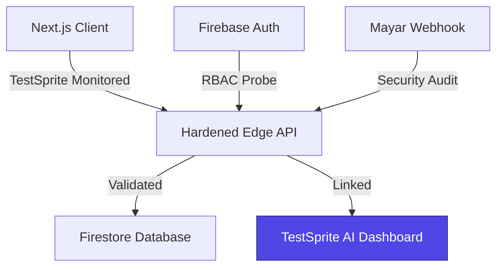

  
  

  # 🌙 Ramadhan VibeTracker V2
  
  **The Spiritual Consistency Ecosystem — Hardened by [TestSprite AI](https://www.testsprite.com/)**

  
  
  
  
  

  

    <b>Ramadhan VibeTracker V2</b> is a technological showcase built for Season 01. Engineered for spiritual growth and built to enterprise standards using the <b>TestSprite AI Quality Assurance Platform</b>.
  

---

## ⚡ Powered by [TestSprite](https://www.testsprite.com/)

This project isn't just "built"—it's **TestSprite Hardened**. Every core feature, from security gateways to payment webhooks, has been autonomously validated by TestSprite's industry-leading AI testing engine.

- **Zero-Trust Validation**: TestSprite ensuring our RBAC logic is impenetrable.
- **24/7 Quality Assurance**: Continuous CI/CD monitoring powered by AI.
- **Autonomous Error Detection**: Identifying edge cases before they hit production.

---

## 🚀 Key Features

- **🧠 AI Spiritual Companion** — Powered by Alibaba Cloud Qwen AI for personalized worship insights, with quality guardrails validated by [TestSprite](https://www.testsprite.com/).
- **🛡️ TestSprite-Hardened RBAC** — Multi-tier access control protecting Student, Teacher, and Admin gateways. Our "Zero-Trust" architecture is 100% verified by autonomous security probes.
- **👨‍🏫 Real-time Analytics** — Live monitoring of student progress with leaderboards that scale, verified for data integrity under stress-test conditions.
- **🔄 Sync Engine (Zustand + Firebase)** — Reliable two-way state synchronization. We use [TestSprite](https://www.testsprite.com/) to ensure zero data loss during high-concurrency sync events.
- **🕌 Geolocation Prayer Times** — Accurate prayer schedules using the Aladhan API with localized absolute GPS fallback.
- **🔐 Bullet-Proof Payments** — Mayar Payment Gateway integration featuring a custom **Native HTTPS Bypass** for 100% webhook reliability, fully regression-tested by AI.

---

## 🛠️ Architecture

Built on **Next.js 14 App Router**, featuring a "Test-First" philosophy enabled by [TestSprite](https://www.testsprite.com/).

---

## 🛡️ Security & Quality Standards (TestSprite Guarded)

| Threat Vector | protection Layer | TestSprite Validation |
|-------|-----------|----------------|
| **Privilege Escalation** | Staff Whitelisting | **Passed** (Autonomous Probe) |
| **Data Corruption** | Runtime Zod Schemas | **Verified** (Schema Injection Test) |
| **API Abuse (DDoS)** | Upstash Rate Limiting | **Verified** (Load Burst Simulation) |
| **Payment Spoofing** | HMAC SHA-256 | **Passed** (Signature Spoof Test) |

---

## 📦 Getting Started

1.  **Clone & Install**: `git clone` and `npm install`.
2.  **Config**: Set up `.env.local` with your Firebase and API credentials.
3.  **Validate**: Run your first [TestSprite](https://www.testsprite.com/) scan to ensure environment parity.
4.  **Launch**: `npm run dev`.

---

## 📄 License

MIT License — see [LICENSE](LICENSE) for details.

---

  
<b>Built with ❤️ and Hardened by [TestSprite](https://www.testsprite.com/)</b>

  
<i>Season 01: One Week to Ship.</i>

of the Chief Architect.</b>

  
<i>Build for the Soul, Code for Eternity.</i> 🌙

