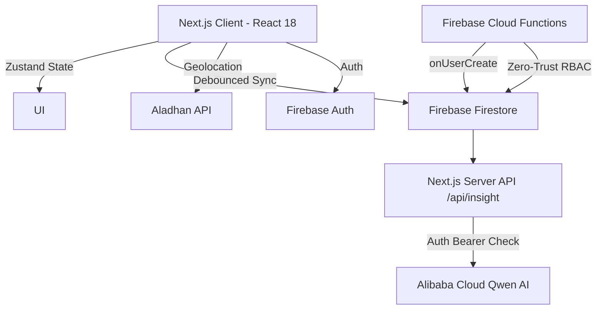

<div align="center">
  
  

  # 🌙 Ramadhan VibeTracker V2
  
  **Interactive AI Ecosystem for Spiritual Consistency**

  [](https://nextjs.org/)
  [](https://reactjs.org/)
  [](https://firebase.google.com/)
  [](https://zustand-demo.pmnd.rs/)
  [](https://tailwindcss.com/)
  [](LICENSE)

  <p align="center">
    Platform pelacakan spiritual terpadu yang dirancang untuk membangun konsistensi ibadah selama bulan suci Ramadhan, diperkuat dengan <b>AI Insights</b> dan <b>Real-time Sync Ecosystem</b>.
  </p>
</div>

---

## 🚀 Fitur Utama

- **🧠 AI Spiritual Companion:** Integrasi dengan Alibaba Cloud Qwen-Turbo LLM untuk memberikan *insight* personal berdasarkan pola ibadah harian pengguna.
- **🔄 Dynamic Progress Weighting:** Kalkulasi real-time yang mempertimbangkan keseimbangan *Sholat Fardhu*, *Tilawah*, dan ibadah *Sunnah*.
- **⚡ Vibe Engine (Zustand + Firebase):** Arsitektur sinkronisasi dua arah yang memastikan data ibadah tidak pernah hilang (*auto-save with debounce mechanism*).
- **🕌 Geolocation-Aware Prayer Times:** Pemanggilan waktu sholat akurat secara dinamis menggunakan API Kemenag (Method 20) dengan *fallback protection*.
- **🔔 Eternal Notification Engine:** Sistem pengingat waktu sholat berbasis Web Push (FCM) dan retensi histori interaktif.
- **🛡️ Enterprise Security:** Validasi *Bearer Token*, Proteksi *Webhook*, dan Sistem Autentikasi terpusat berbasis peran (RBAC).
- **👨‍🏫 Multi-Role Dashboard:** Portal Ustadz (Real-time Monitoring), Parent Observer, dan Student Dashboard.
- **📊 Heatmap Konsistensi:** Visualisasi kalender ibadah 30 hari menggunakan `react-calendar-heatmap`.

## 🛠️ Arsitektur Teknologi

Sistem dibangun menggunakan pendekatan **App Router** modern dengan pemisahan *client-side logic* dan *serverless API*.



## 📦 Instalasi & Penggunaan

### 1. Prasyarat Sistem

* Node.js versi 18.17.0 atau lebih tinggi.
* Akun Firebase (Authentication, Firestore, Cloud Messaging).
* API Key Alibaba Cloud (untuk AI Insights).

### 2. Kloning Repositori

```bash
git clone https://github.com/0xshalah/Ramadhan-VibeTracker-V2.git
cd Ramadhan-VibeTracker-V2
```

### 3. Konfigurasi Variabel Lingkungan

Salin file `.env.local.example` menjadi `.env.local` dan isi parameter keamanan Anda:

```env
# Firebase Configuration
NEXT_PUBLIC_FIREBASE_API_KEY=your_api_key
NEXT_PUBLIC_FIREBASE_AUTH_DOMAIN=your_auth_domain
NEXT_PUBLIC_FIREBASE_PROJECT_ID=your_project_id
NEXT_PUBLIC_FIREBASE_STORAGE_BUCKET=your_storage_bucket
NEXT_PUBLIC_FIREBASE_MESSAGING_SENDER_ID=your_sender_id
NEXT_PUBLIC_FIREBASE_APP_ID=your_app_id
NEXT_PUBLIC_FIREBASE_VAPID_KEY=your_vapid_key_for_fcm

# AI / Backend Keys
ALIBABA_CLOUD_API_KEY=your_qwen_api_key

# Mayar Webhook
MAYAR_WEBHOOK_SECRET=your_webhook_secret

# Firebase Admin (Server-side)
FIREBASE_ADMIN_PROJECT_ID=your_project_id
FIREBASE_ADMIN_CLIENT_EMAIL=your_client_email
FIREBASE_ADMIN_PRIVATE_KEY=your_private_key
```

### 4. Menjalankan Server Pengembangan

```bash
npm install
npm run dev
```

Aplikasi akan berjalan pada `http://localhost:3000`.

### 5. Deploy Cloud Functions (Optional)

```bash
cd functions
npm install
firebase deploy --only functions
```

## 🧪 Validasi & Pengujian

Sistem ini mematuhi standar *Vibe Coding* yang divalidasi secara otomatis menggunakan infrastruktur **TestSprite MCP**.

Cakupan pengujian (lihat `/testsprite_tests`):

- [x] End-to-End *Sadaqah Webhook Lifecycle*.
- [x] *Stress Test* Sinkronisasi UI (Tilawah Tracker).
- [x] Deteksi Anomali Zona Waktu (Penanganan *Anti-UTC Sabotage*).

## 🛣️ Peta Jalan (Roadmap)

- [x] **Fase 1:** *Core Tracking*, *AI Insights*, *FCM Notifications*.
- [x] **Fase 2:** Enterprise Security & Frontend Decoupling.
- [ ] **Fase 3:** Migrasi *Codebase* ke **TypeScript** & implementasi Zod Validation.
- [ ] **Fase 4:** Implementasi *Leaderboard* instansi menggunakan *Cloud Functions Aggregation*.
- [ ] **Fase 5:** Ekspansi ke ekosistem *Mobile Offline-First* menggunakan **Flutter**.

## 🛡️ Standar Keamanan

- **Zero-Trust Backend:** Logika RBAC & Donation Resolver dieksekusi di Firebase Cloud Functions (`onUserCreate`), bukan di klien.
- **API Guard:** Endpoint AI (`/api/insight`) dilindungi dengan validasi header `Authorization` Bearer Token.
- **Webhook Integrity:** HMAC SHA-256 signature validation dengan `timingSafeEqual` di endpoint Mayar.
- **Race Condition Prevention:** Debounced state synchronization pada penambahan XP.

---

<div align="center">
  <p><b>Build for the Soul, Code for Eternity.</b> 🌙</p>
</div>
