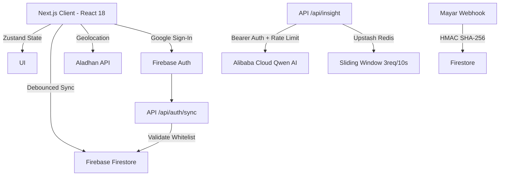

<div align="center">
  
  

  # 🌙 Ramadhan VibeTracker V2
  
  **Interactive AI-Powered Spiritual Consistency Ecosystem**

  [](https://nextjs.org/)
  [](https://www.typescriptlang.org/)
  [](https://firebase.google.com/)
  [](https://zustand-demo.pmnd.rs/)
  [](https://zod.dev/)
  [](https://tailwindcss.com/)
  [](LICENSE)

  <p align="center">
    A unified spiritual tracking platform designed to build worship consistency during the holy month of Ramadhan, powered by <b>AI Insights</b>, <b>Real-time Sync</b>, and <b>Enterprise-grade Security</b>. <br/>
    Built for <b>Hackathon Season 01: One Week to Ship</b>.
  </p>
</div>

---

## 🚀 Key Features

- **🧠 AI Spiritual Companion** — Integration with Alibaba Cloud Qwen-Turbo LLM for personalized worship insights and motivation based on daily activity patterns.
- **🛡️ Zero-Trust RBAC & Dual Gateway** — Multi-tier role-based access control protecting Student, Teacher, and Super Admin gateways. Includes a `whitelisted_staff` architecture to prevent role escalation.
- **👨‍🏫 Global Teacher & Admin Portals** — Real-time live monitoring of student progress with materialized view aggregation for cost-efficient leaderboards.
- **🔄 Vibe Engine (Zustand + Firebase)** — Two-way state synchronization with debounced auto-save, ensuring worship data is never lost.
- **🕌 Geolocation-Aware Prayer Times** — Dynamic prayer schedule using the Aladhan API (Kemenag RI Method 20) with GPS fallback protection.
- **📊 Consistency Heatmap & Analytics** — GitHub-style contribution calendar visualizing 30-day worship activity, individual deep-dive student analytics.
- **🔐 Enterprise Security** — 4-layer API defense (Auth → Rate Limiting → Payload Validation → LLM), Cloud Functions, and HMAC webhook verification for digital Sadaqah.
- **👮 Dual-Layer Type Safety** — TypeScript for compile-time protection + Zod for runtime data validation against corrupted Firestore payloads.

## 🛠️ Architecture

Built on the **Next.js 14 App Router** with clear separation between client-side logic and serverless API routes.



### Full-Stack Decoupling

| Layer | Implementation | Responsibility |
|-------|------|----------------|
| **Core UI** | `app/dashboard/*/` | Dynamic Routing, Next.js App Router, Tailwind Styles |
| **Logic Hooks** | `hooks/usePrayerTimes.js`, `useVibeSync.js` | Geolocation, Debounced network calls, API orchestration |
| **State Mngr** | `store/useVibeStore.ts` | Zustand global state with strict TypeScript interface |
| **Data Layer** | `lib/firebase.ts` | Firestore read/write, Real-time `onSnapshot` listeners |
| **Edge API** | `app/api/*/route.ts` | Auth Whitelist Sync, Secure LLM Proxy, Webhooks |
| **Validation** | `lib/schemas.ts` | Zod runtime schemas acting as absolute source of truth |

## 📦 Installation

### Prerequisites

- Node.js 18.17.0 or higher
- Firebase project (Authentication, Firestore Database)
- Alibaba Cloud API Key (for AI Insights)
- Upstash Redis account (for Rate Limiting — optional, graceful degradation)

### Setup

```bash
# 1. Clone the repository
git clone https://github.com/0xshalah/Ramadhan-VibeTracker-V2.git
cd Ramadhan-VibeTracker-V2

# 2. Install dependencies
npm install

# 3. Configure environment variables
cp .env.local.example .env.local
# Fill in your Firebase, Alibaba Cloud, Upstash, and Mayar credentials

# 4. Start development server
npm run dev
```

### Environment Variables (.env.local)

```env
# Client-Side Firebase
NEXT_PUBLIC_FIREBASE_API_KEY=
NEXT_PUBLIC_FIREBASE_AUTH_DOMAIN=
NEXT_PUBLIC_FIREBASE_PROJECT_ID=
NEXT_PUBLIC_FIREBASE_STORAGE_BUCKET=
NEXT_PUBLIC_FIREBASE_MESSAGING_SENDER_ID=
NEXT_PUBLIC_FIREBASE_APP_ID=

# AI Engine / Analytics
ALIBABA_CLOUD_API_KEY=

# Rate Limiting (Optional)
UPSTASH_REDIS_REST_URL=
UPSTASH_REDIS_REST_TOKEN=

# Firebase Admin SDK (Server-Side For Webhooks/Sync)
FIREBASE_ADMIN_PROJECT_ID=
FIREBASE_ADMIN_CLIENT_EMAIL=
FIREBASE_ADMIN_PRIVATE_KEY=
```

### Required Firestore Setup

To access the Teacher/Admin dashboards, create a collection named `whitelisted_staff` in Firestore:
- **Document ID**: The Google Email of the staff member
- **Field**: `role` (string) = `teacher` or `admin`

Deploy Firestore Rules:
```bash
npx firebase deploy --only firestore:rules
```

## 🛡️ Security Standards

| Threat Vector | Protection Layer | Implementation |
|-------|-----------|----------------|
| **Privilege Escalation** | Staff Whitelisting | `api/auth/sync` verifies admin-created documents |
| **Data Corruption** | Runtime Validation | Zod `.passthrough()` and strict type schemas |
| **API Abuse (DDoS)** | Rate Limiting | Upstash Redis Sliding Window (3 req/10s) |
| **Cross-User Data Leak** | Zero-Trust Rules | `firestore.rules` enforces `isOwner()` |
| **Payment Spoofing** | Webhook Integrity | HMAC SHA-256 + `timingSafeEqual` |

## 🧪 Testing & Validation

Architectural integrity validated iteratively via AI-driven QA logic and manual structural tests.

- [x] End-to-End Sadaqah Webhook Lifecycle
- [x] Onboarding Deadlock Catch-22 Resolution
- [x] In-App Navigation Routing Matrix Test
- [x] UI Synchronization Stress Test (Tilawah Tracker)
- [x] Timezone Anomaly Detection

## 🛣️ Roadmap Genesis to Production

- [x] **Phase 1-4** — Static HTML mockups translated to Next.js component structures.
- [x] **Phase 5-7** — Firestore integration, Zod schema runtime validation, Zustand state binding.
- [x] **Phase 8-9** — LLM prompt engineering, edge computing webhooks, animation polish.
- [x] **Phase 10-12** — Role-Based Access Control, Dual Login Gateway, Whitelisted Staff Architecture.
- [x] **Phase 13** — Super Admin Console, Global Telemetry, Final QA and Production Deployment.

## 📄 License

MIT License — see [LICENSE](LICENSE) for details.

---

<div align="center">
  <p><b>Engineered by Antigravity under the direction of the Chief Architect.</b></p>
  <p><i>Build for the Soul, Code for Eternity.</i> 🌙</p>
</div>
